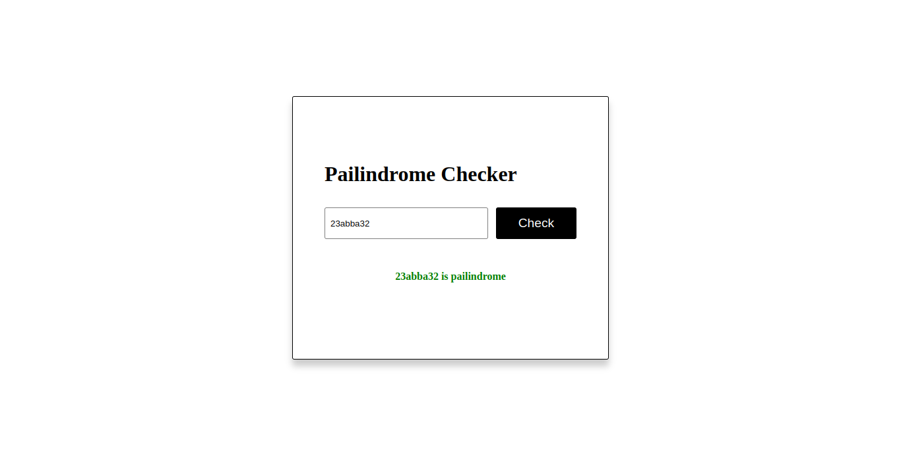

# Palindrome Checker


Welcome to the Palindrome Checker project! This is a simple web application that checks if a given word is a palindrome or not. A palindrome is a word, phrase, number, or other sequences of characters that reads the same forward and backward (ignoring spaces, punctuation, and capitalization).

## Screenshots




## Table of Contents

- [Demo](#demo)
- [Features](#features)
- [Getting Started](#getting-started)
- [Usage](#usage)

## Demo

You can try the Palindrome Checker live at [Live Project Link](https://pailindrome-checker-avi.netlify.app).

## Features

- Check if a word is a palindrome.
- User-friendly interface.
- Responsive design.

## Getting Started

To get a copy of this project up and running on your local machine, follow these simple steps:

1. **Clone the repository:** to your local machine using `git clone`.

```bash
git clone https://github.com/your-username/your-repo-name.git
```

2. **Open the Project Folder:** Navigate to the project folder using your preferred code editor. For example, if you're using Visual Studio Code, you can run:

```
code your-repo-name
```

Replace **your-repo-name** with the actual name of your project folder.

3. **View the Application:** Open the **index.html** file in your web browser or a local development server. You can do this by simply double-clicking the file or using a local server like **Live Server** if you're using Visual Studio Code.

4. **Start Testing:** Now that the project is open in your browser, you can start testing the Palindrome Checker. Enter a word or phrase in the input field, click the "Check" button, and observe the result displayed below. It will indicate whether the input is a palindrome or not.

That's it! You've successfully set up and run the Palindrome Checker on your local machine.

```js
Make sure to replace `your-username` and `your-repo-name` with your actual GitHub username and repository name.
```

## Usage

1. Enter a word or phrase in the input field.
2. Click the "Check" button.
3. The result will be displayed below, indicating whether the input is a palindrome or not.

## Contact Author

- Blogs - [My Hashnode Blogs](https://hashnode.com/@aviralsharma)
- Frontend Mentor - [aviralsharma07](https://www.frontendmentor.io/profile/aviralsharma07)
- Twitter - [\_aviral07](https://www.twitter.com/_aviral07)
